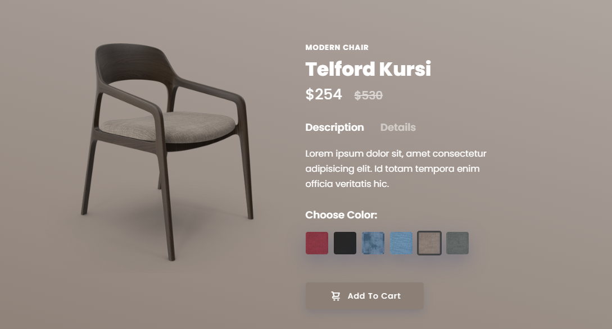

 Modern Chair

Welcome to the **Modern Chair Project**, a simple yet elegant web interface for showcasing and selling chairs online. This project is built using **HTML** and **CSS** as a part of my initial exploration into web development.

## Features

- **Clean and Minimal UI:** A user-friendly design to attract potential buyers.
- **Responsive Layout:** It allows users to change the background color, and upon changing the color, a chair on the page vibrates, adding an interactive element.
- **Product Showcase:** Beautifully designed section to display chair with image and description.

## Technologies Used

- **HTML:** For creating the structure of the webpage.
- **CSS:** For styling the page and enhancing visual appeal.

### Screenshot
